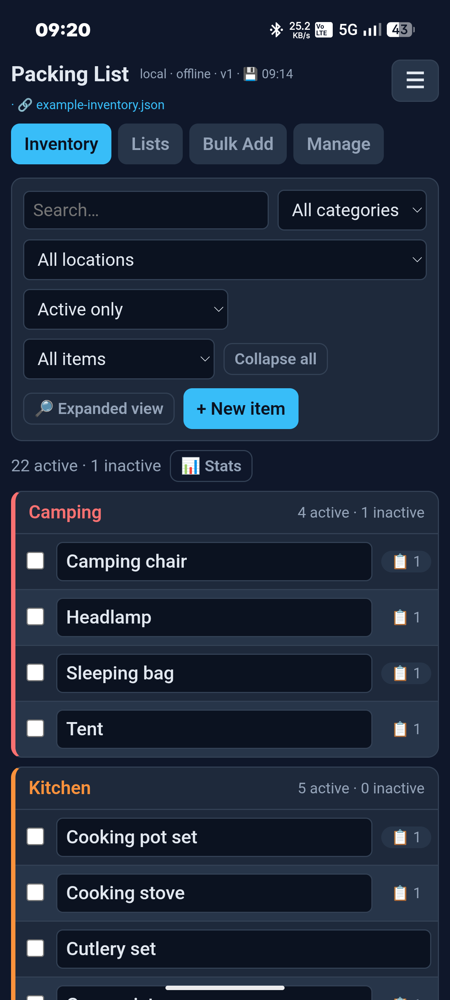
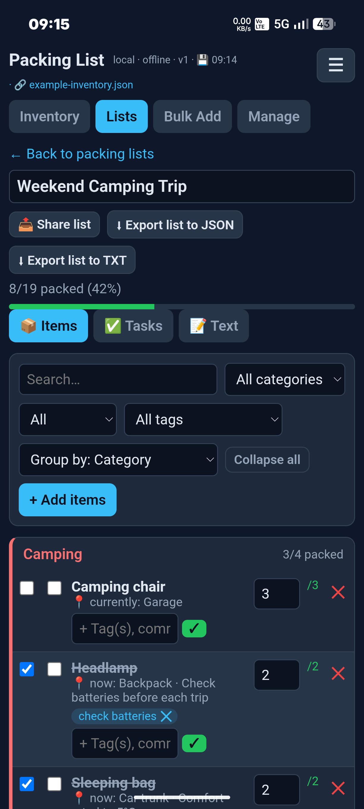
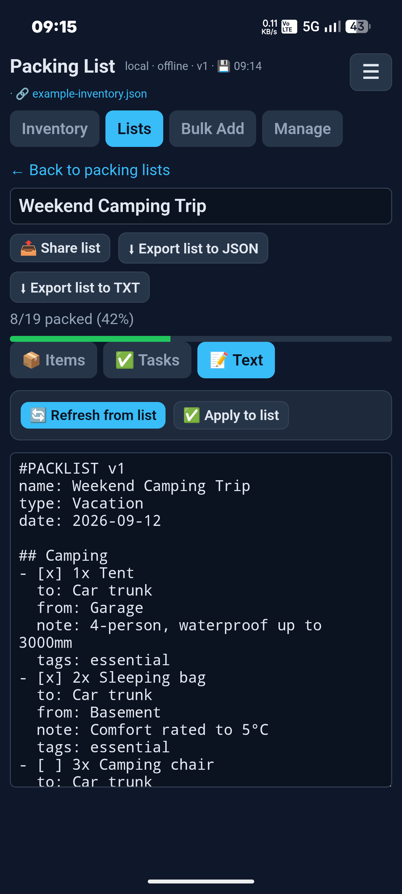
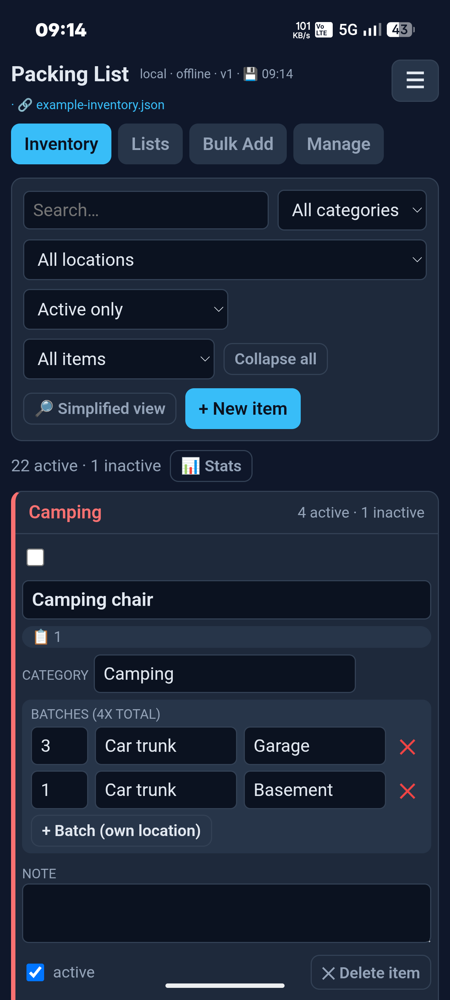
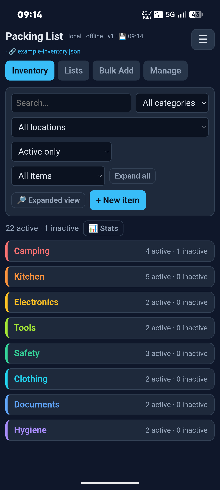
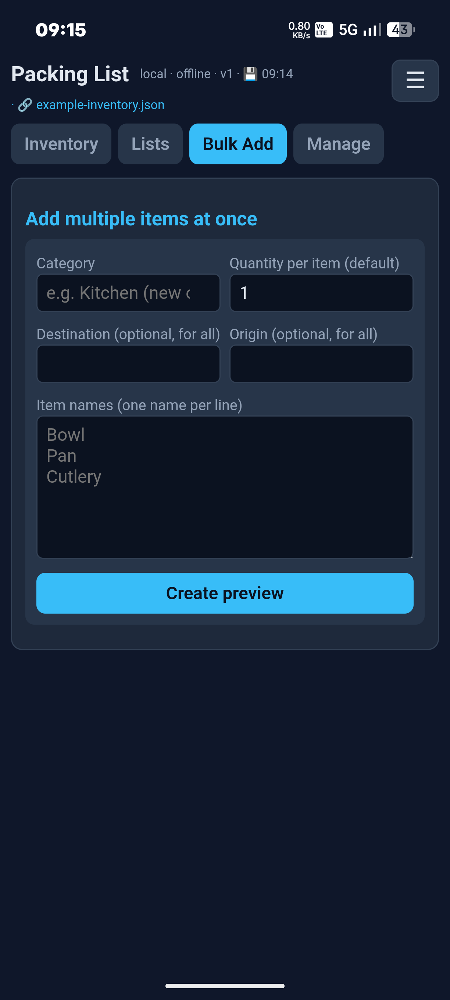
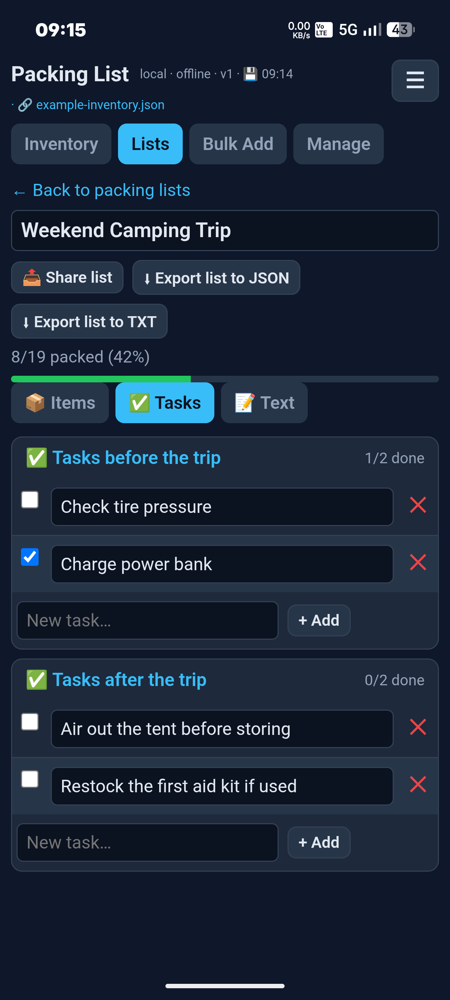
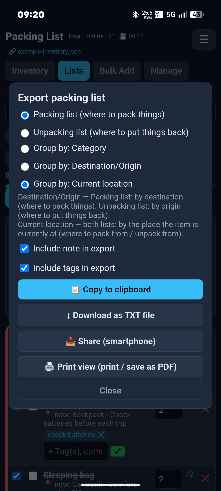
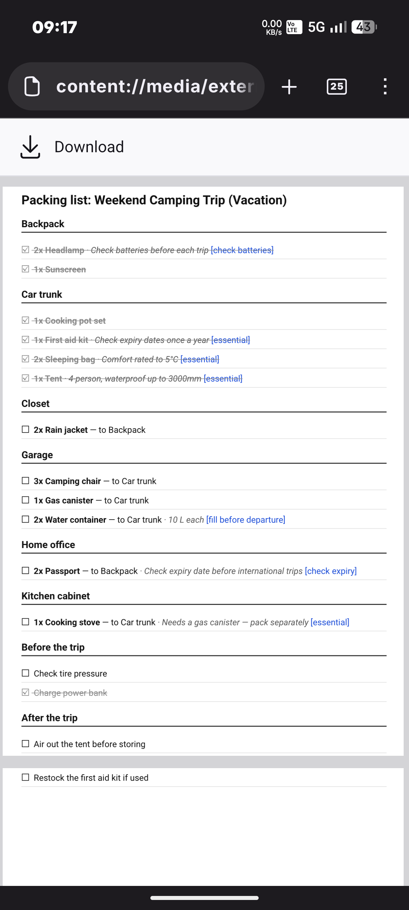
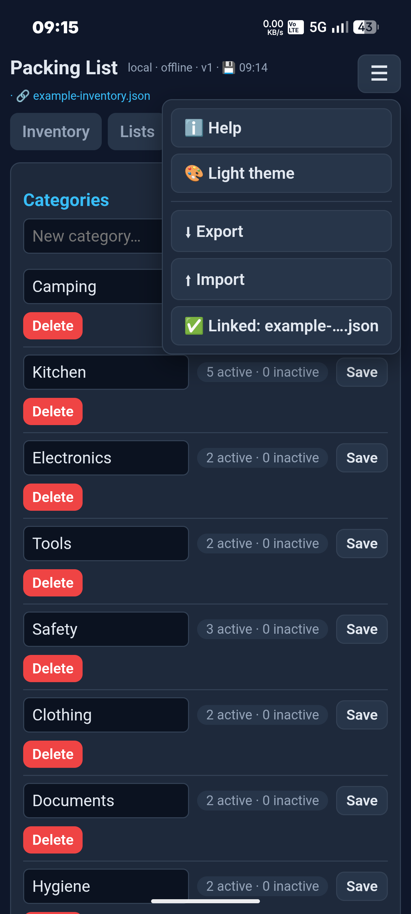

# Packing List

A local-first packing list app for trips, camping, or anything you pack repeatedly. Keep one inventory of everything you own, build packing lists from it in seconds, and never wonder again whether that missing folding chair is in the garage or already in the car.

**[Open the web app](https://t3ste.github.io/packing-list/)** · **[Download Android app](https://github.com/t3ste/packing-list/releases/latest)** · No account, no cloud, no tracking — your data stays on your device.

  
  
  

## About

Most packing-list apps make you retype the same items for every trip. This one flips that around: you maintain **one inventory** (with quantities and where each thing currently lives), and packing lists are just a selection *from* that inventory. Add "4 chairs" once; use them in five different trips without re-entering anything.

It started as a personal tool for outfitting a camper van and grew into a general-purpose app — the inventory model works just as well for camping gear, moving house, business travel, or a base full of shared equipment.

Runs as a website, an installable Progressive Web App (desktop and iOS), or a standalone Android app — same code, same data model, your choice.

## Features

### Inventory
- One central list of everything you own, organized by category.
- **Batches**: a single item can exist in multiple places at once with different quantities — e.g. "6 chairs" split into "4 in the garage → roof box" and "2 in the living room → trunk", tracked as one item.
- Active/inactive flag for things you own but aren't currently using (skip them without deleting).
- Simplified view (name only, one line per item) or expanded view (full detail) — toggle any time.
- Usage badge on every item shows at a glance whether it's currently used in a packing list, and in how many.
- Filter by category, current location, active status, or list usage.
- Bulk add: create several items in one category in one pass.

  
  
  

### Packing lists
- Build a list by picking items straight from the inventory; the picker shows how many are available and flags in real time if you've selected more than you have.
- Check items off as you pack; a progress bar shows how far along you are.
- Group the view by category, destination, origin, or current location.
- Tasks-before-the-trip and tasks-after-the-trip checklists, separate from the item list.
- Tags on individual list items for your own cross-cutting labels.

  

### Import & export
- Full backup as JSON (entire inventory + all lists) — for safekeeping or moving to another device.
- Per-list export as JSON (round-trips perfectly back into the app) or as plain text (`#PACKLIST v1` format — human-readable, hand-editable, and re-importable).
- A **Text tab** on every list shows and lets you edit that same plain-text format directly, with a button to apply your edits back onto the list.
- Share a formatted, human-readable version of a list (for messaging apps, etc.), or open a print-friendly view.

  
  

### Customization & housekeeping
- Light and dark theme.
- Manage your own categories and locations (rename, delete, merge).
- Warnings before deleting anything still referenced by a packing list — no silent data loss.
- A small stats view (total items, batches, units, how many are actively used) for a sanity check on a growing inventory.

  

### Keeping your data safe
- Everything is stored locally in the browser/app by default — nothing is sent anywhere.
- **Desktop browsers**: optionally link a local file (via the browser's file picker); every change is then also written straight to that file automatically, so you always have your own readable, portable backup — no manual export needed.
- **Android app**: the equivalent native version of the same idea — on first launch, choose to create a new file, open an existing one, or skip. Once linked, it's kept in sync automatically; skipping doesn't lose anything, it just keeps the backup inside the app's own storage instead of a file you can browse to yourself.

### Android app specifics
The Android app is a standalone package (no Chrome or any browser needs to be installed) built with [Capacitor](https://capacitorjs.com/) — the same web app, bundled to run entirely offline in Android's built-in system WebView. A couple of things work a little differently from the website version because of that:
- File linking uses Android's own file picker (Storage Access Framework) rather than the browser API.
- Exporting/sharing/printing goes through Android's native share and print dialogs instead of a browser download.

## Typical flow

1. **Set up your inventory once.** Add the things you own — a chair, a stove, your passport — each with a quantity and where it currently lives. Use "Bulk Add" if you're entering a lot at once, or import the included starter file to begin from ~40 common example items instead of a blank slate.
2. **Create a packing list** for a specific trip and give it a name and date.
3. **Pick items from your inventory.** The picker shows what's available and where it currently is; select what this trip needs.
4. **Pack.** Check items off as you physically pack them; the progress bar tracks how far along you are. Set any before/after-trip tasks (e.g. "check tire pressure", "wash the tent") alongside it.
5. **After the trip**, "unpack" the same list the other direction — it now tells you where each item should go back to.
6. **Export or share** the list as text, PDF, or a re-importable file whenever you need a copy outside the app — or just leave everything where it is; a linked file (if you set one up) already keeps itself current.

## Pros and cons

**Pros**
- Works fully offline, no account, no server, no data leaves your device unless you export it yourself.
- One inventory reused across every list — no retyping the same items for every trip.
- The batch/location model handles "some of these are here, some are there" in a way flat packing-list apps can't.
- Same app, three ways to run it (website, installable PWA, standalone Android app) — pick what suits the device.
- Everything is a single hand-editable HTML file per platform variant — no build step, easy to audit, easy to fork.
- Plain-text export format is genuinely re-importable, not just a one-way printout — useful as an actual backup, not only a receipt.

**Cons**
- No cloud sync or multi-device sharing — moving data between devices is a manual export/import (or use the same linked file, e.g. via a synced folder, yourself).
- No iOS app yet — iOS users get the installable web app (Safari's "Add to Home Screen"), which can't do local file linking (Apple's WebKit doesn't implement the browser API this needs).
- The Android app renders through a bundled WebView rather than fully native UI components — fast and lightweight, but not pixel-identical to a from-scratch native app.
- Distributed as a direct APK download (GitHub Releases) rather than through the Play Store — you'll need to allow "install unknown apps" once for your browser/file manager.
- Being a solo/hobby project, there's no dedicated support channel beyond GitHub issues.

## Download & install

### Browser (no install, all platforms)
Open **[t3ste.github.io/packing-list](https://t3ste.github.io/packing-list/)** directly — no install, no app store, no Android required. This is the alternative to the Android app for **iOS** and **desktop**, and the quickest way to just try the app anywhere.

⚠️ Everything works the same regardless of browser, with one exception: **local file linking** (see *Keeping your data safe* above) needs the browser's File System Access API, which only Chrome and other Chromium-based browsers support (Edge, Brave, Opera, Vivaldi, …). On Safari or Firefox — and on **iOS in general**, since every browser there is required to run on Apple's WebKit — this feature isn't available; the app still works fully, you just export/import manually instead of keeping a self-updating linked file.

On Android/desktop Chrome or Edge you'll also get an "Install" prompt to add it as an app icon (installing is optional — the plain browser tab behaves identically); on iOS use Safari's Share → "Add to Home Screen".

### Android (standalone app)
1. Download the latest APK from **[Releases](https://github.com/t3ste/packing-list/releases/latest)**.
2. Open the downloaded file; Android will ask to allow installs from that source once (Settings → apps → "Install unknown apps") — allow it, then confirm the install.
3. On first launch, choose whether to link a local file for backups, or skip (see **Keeping your data safe** above).

Package ID `com.t3ste.packinglist`, minimum Android 5.0 (API 21).

## Filling an empty inventory

The app starts empty by design. Either build your inventory up yourself (Inventory tab → "+ New item"), or import one of the example files below — everything in them can be renamed, edited, or deleted afterwards.

| File | What it is | How to import |
|---|---|---|
| [`starter-inventory-import.json`](starter-inventory-import.json) | A broad starting point: ~40 generic, everyday items across 15 categories | ☰ menu → **Import** |
| [`example-inventory.json`](example-inventory.json) | A smaller, curated set (23 items across 8 categories) demonstrating batches, notes, locations, and an inactive item — used for the screenshots above | ☰ menu → **Import** |
| [`example-packing-list.json`](example-packing-list.json) | A matching sample packing list (12 items, some already packed, with tags and before/after-trip tasks) | Lists tab → **Import list from JSON** (import the example inventory above *first*, so items match up instead of being duplicated) |

⚠️ **Import order matters:** import `example-inventory.json` first, *then* `example-packing-list.json`. Importing the list before its matching inventory exists (or against a different inventory) doesn't fail — it just recreates every item as a new one instead of reusing what's already there, leaving you with duplicates.

The ☰ menu's **Import** replaces your entire inventory and lists, so only use it when you actually want to start over from one of these files.

## License

No license has been chosen for this project yet — all rights reserved by default. Get in touch via GitHub issues if you'd like to use or adapt this beyond personal use.

## Feedback & issues

Bug reports and feature suggestions are welcome via [GitHub Issues](https://github.com/t3ste/packing-list/issues).
